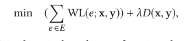

# dreamplace

DREAMPlace: Deep Learning Toolkit-Enabled GPU Acceleration for Modern VLSI Placement

指出分析布局算法和训练神经网络之间的相似性。使用神经网络方法来解决布局问题。

布局的目标是在无重叠的情况下优化下式：

## 相似性

深度学习的基本思路是，将带有特征向量和标注值的数据输入，在一组可变参数w的控制下进行训练，使得预测的误差（加上正则项）最小。

因此，可以把cell的坐标(x,y)当作神经网络的参数w，训练的数据就是netlist，相应的标注都是0，神经网络的输出是对应的线网长度。此时如果使用绝对误差函数作为误差函数，神经网络就会优化总线网长度。

因为布局的密度和具体的数据无关，所以可以用作正则项。此时，就完成了一一对应。

## 实现

复用已有的框架，只需要编写对应于线网长度和密度的函数。