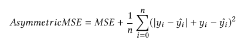

# pre-routing timing prediction

目前如何解决在布线前进行时序优化的问题
- 使用延迟上限值作为时间估计
- 采用不满足时序约束时重新布局的方法

本文使用机器学习的方法进行预测。模型针对的是单个的net，需要结合PERT算法计算整体的指标。

模型计算的是从输入端到其中一个输出端的延迟，不考虑输入端的不同，也不考虑上升时间和下降时间的区别。预测的时间既包括导线的延迟，也包括门的延迟。

模型的输入特征：
- 输入和输出的容量
- 输入端和目标输出端的距离
- 信号传递时间
- 其他输出端的特征，比如
    + 其他输出端位置的中位值
    + 标准差

## 训练方法

Lasso:

$y_i = x_i^Tw$

神经网络
- 平均平方误差
- 自定义的误差函数

随机森林——一系列决策树