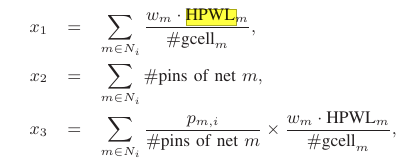
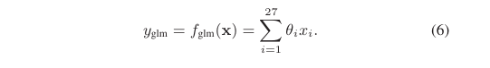

# ultrascale fpga placement

这里，关注使用机器学习进行拥挤预测的部分：

抽取了如下的特征：

其中，HPWL是半周线长，衡量线长。w是和net m的引脚数正比的系数，#gcell是net m横跨的单元数目。pmi是m在s单元里的引脚数目。

三种机器学习模型：

- 局部线性模型：

- 层次结合模型：
首先使用局部线性模型得到局部的拥挤预测值，然后用当前单元和附近八个单元的预测值作为特征输入SVM。用SVM的输出作为模型的输出
- 全局线性模型：类似局部的线性模型，但是把附近八个单元的特征也作为输入，一共27个feature。

两种训练方法：
- 训练一个模型
- 对每一个具体的设计，都训练一个模型