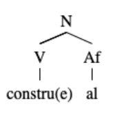

# 期末注意事项

## 语音学

1. 英语多音节词转写标注重音
2. 轻声标调（小圈）
3. 零声母的情况（可能确实没有音，也可能是[j],[w]）
4. i的舌尖前/后元音
5. ya是[ia]。同理，y和w可能分别是在代表i和u（也有可能是零声母，如yue）
6. wei是[ui]
7. j、q、x后的uan是[yɛn]，其他的是uan（jqx后只能是y和i）
8. /a/在i、y和n之间实现为[ɛ],/e/在i和y后实现为[ɛ]
9. /a/在后鼻韵里实现为ɑ

## 音系学

1. 音系学规则内只能出现特征描写和代替符号，不能出现国际音标
2. 中缀（插入词根）与前后缀的区别

## 形态学

.形态结构树：注明词缀和词类

## 句法学

句法结构树

1. XP到X的一步容易漏掉
2. 不要改句子
3. deP由S引导的情况
4. Adv和Aux的区分
5. 天/年等是量词（哪一天：省略名词）
6. 需要（V）你（N）帮我买东西（S）
7. S子句中省略语要注明（如主语、宾语：为遮挡阳光编（帽圈）  的帽圈、（孩子）在摇篮里饿了三个小时的孩子）