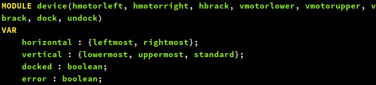
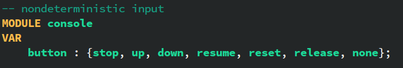

# 软件分析与验证大作业报告

计76 韩志磊

## 问题概述

CT是安全攸关的系统。考虑到设备本身的专业性和各种紧急情况，CT扫描器系统具有较高的安全性要求。为了保证系统的正确性，使用模型检测的方法来进行验证。

CT扫描器是一个多输入的系统，可以分为控制面板、机械床、传感器、CPU四个部分。系统的变迁较为复杂，输入之间有对抗，因此需要比较细致的建模。

## 系统建模

首先高屋建瓴地来讲，我将此CT系统视为同步式离散时间系统来建模。因为使用的工具NuSMV也是同步式的，因此建模比较方便。简单地来讲，我认为系统的时间是离散的，由一个个的「时间片」组成。在第n个时间，系统有一定的状态，然后做出一定的决策，在第n+1个时间开始的瞬间进入新的状态。

同步式意味着系统的组件之间遵循同一个时钟，不会在时间片之间出现状态的变化。实际的世界中，CT系统是异步的，如在电机的移动过程中有可能出现人力阻止。但因为异步系统可以用同步系统来模拟，所以采用这种抽象并不会减少系统的行为。

### 状态量

我将系统的状态空间局限为有限的。这意味着空间变量需要离散化。我在此做了抽象，即认为水平方向只有最左和最右两个位置；垂直方向只有最低、最高和标准三个位置。

这一抽象的合理性可以被如下地说明：因为对CPU而言，它控制着状态的变迁，而水平位置对状态的影响只在于其在最左还是最右；同理，垂直位置对状态的影响只在于其和标准高度的相对位置（上，等，下）。

除开这两组状态量，还有系统是否对接，系统处于的状态以及系统是否已经设置标准高度这三个状态量。总结如下：

|                                  | 取值数量 |
| -------------------------- | ------------- |
| 水平位置                 | 2               |
| 垂直位置                 | 3               |
| 是否对接                 | 2               |
| 系统状态                 | 3               |
| 是否设置标准高度 | 2               |

这些状态量张成的状态空间只有72个状态，而且并非所有都是可达的。因此，大大简化了验证的复杂度

和物理世界有关的状态量在device模块中：

和CPU相关的状态量在processor模块中：

### 事件

事件是在一个时间片内有效的量，一般是布尔类型（出现/不出现）。比如，电机尝试的移动方向，制动器的施加与否，对接/取消对接的请求等。这些事件都只和当前状态有关，在下一时间片，它们的值重新计算。因此，事件也就是组合逻辑实现的一些变量。

在我的实现中，用到了9个事件：

|                  | 取值 |
| ------------- | ------ |
| 水平向左 | 2       |
| 水平向右 | 2       |
| 垂直向上 | 2       |
| 垂直向下 | 2       |
| 水平制动 | 2       |
| 垂直制动 | 2       |
| 对接         | 2       |
| 取消对接 | 2       |
| 用户输入 | 6       |

