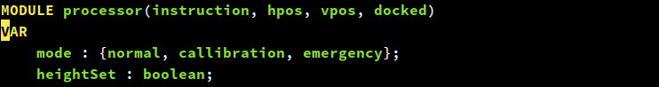

# 软件分析与验证大作业报告

计76 韩志磊

## 问题概述

CT是安全攸关的系统。考虑到设备本身的专业性和各种紧急情况，CT扫描器系统具有较高的安全性要求。为了保证系统的正确性，使用模型检测的方法来进行验证。

CT扫描器是一个多输入的系统，可以分为控制面板、机械床、传感器、CPU四个部分。系统的变迁较为复杂，输入之间有对抗，因此需要比较细致的建模。

## 系统建模

首先高屋建瓴地来讲，我将此CT系统视为同步式离散时间系统来建模。因为使用的工具NuSMV也是同步式的，因此建模比较方便。简单地来讲，我认为系统的时间是离散的，由一个个的「时间片」组成。在第n个时间，系统有一定的状态，然后做出一定的决策，在第n+1个时间开始的瞬间进入新的状态。

同步式意味着系统的组件之间遵循同一个时钟，不会在时间片之间出现状态的变化。实际的世界中，CT系统是异步的，如在电机的移动过程中有可能出现人力阻止。但因为异步系统可以用同步系统来模拟，所以采用这种抽象并不会减少系统的行为。

### 状态量

我将系统的状态空间局限为有限的。这意味着空间变量需要离散化。我在此做了抽象，即认为水平方向只有最左和最右两个位置；垂直方向只有最低、最高和标准三个位置。

这一抽象的合理性可以被如下地说明：因为对CPU而言，它控制着状态的变迁，而水平位置对状态的影响只在于其在最左还是最右；同理，垂直位置对状态的影响只在于其和标准高度的相对位置（上，等，下）。

除开这两组状态量，还有系统是否对接，系统处于的状态以及系统是否已经设置标准高度这三个状态量。总结如下：

|                                  | 取值数量 |
| -------------------------- | ------------- |
| 水平位置                 | 2               |
| 垂直位置                 | 3               |
| 是否对接                 | 2               |
| 系统状态                 | 3               |
| 是否设置标准高度 | 2               |

这些状态量张成的状态空间只有72个状态，而且并非所有都是可达的。因此，大大简化了验证的复杂度

和物理世界有关的状态量在device模块中：

和CPU相关的状态量在processor模块中：

### 事件

事件是在一个时间片内有效的量，一般是布尔类型（出现/不出现）。比如，电机尝试的移动方向，制动器的施加与否，对接/取消对接的请求等。这些事件都只和当前状态有关，在下一时间片，它们的值重新计算。因此，事件也就是组合逻辑实现的一些变量。

在我的实现中，用到了9个事件：

|                  | 取值 |
| ------------- | ------ |
| 水平向左 | 2       |
| 水平向右 | 2       |
| 垂直向上 | 2       |
| 垂直向下 | 2       |
| 水平制动 | 2       |
| 垂直制动 | 2       |
| 对接         | 2       |
| 取消对接 | 2       |
| 用户输入 | 6       |

### 系统行为

CT扫描仪最重要的行为是三种模式的变迁，我的实现如下：

可以看到，下一个状态的mode取决于这一状态的mode以及其他若干事件的值，因此类似于时序逻辑。

事件方面，以水平方向的制动器为例，实现如下：

可以看到，事件的值是确定的，只取决于当前的状态，以及其他的事件的值。因为NuSMV会静态检查变量之间的依赖关系，不会有循环赋值的情况出现。

对CT的建模基本上就是按照作业文档里的描述实现的，这里不再赘述。

## 验证

文档中给出的23条规范中，有一部分没有限制处于正常模式；此外，以下三条性质是矛盾的：

1. 如果竖直电机关闭,则必须施加竖直制动器;
2. 紧急模式一旦触发,如果施加了竖直制动,那么必须自动取消以方便医护人员能将病人从机械床上带出到扫描器外;
3. 如果紧急模式启动,所有的电机都不允许启动;

根据上下文和系统的行为描述，我认为2应该改为「施加了水平制动，并且机械床不在最右侧」。

除了这些约束，我还验证了系统不会宕机，也就是说不会出现相互矛盾的命令，如电机同时向上和向下。这条性质用一个辅助的error状态来表示：

大部分的规范用LTL可以表达。有少量的规范需要用到CTL，比如「机械床在最右侧，并且已经对接，那么取消对接总是可能的 」：

关于fairness性质，之前实现有一些问题，用了CTL中的AG EF p。这和LTL中的G F p不等价，但两者都不能完全描述无限经常这一概念。使用NuSMV自带的fairness语句能解决这个问题。

### 效果

运行截图如下：

## 总结

本次大作业加深了我对模型检测的认识，尤其是认识到「建模是一种艺术」。在实现的过程中，必须权衡模型大小对验证的影响，以及反映客观世界的准确程度。两者通常是难以调和的。

我在之前版本的程序中没有进行恰当的抽象，导致最终未能完成。这一新版本的程序对系统做了较多的抽象，状态空间较小的同时也方便了验证，缺点则是可能不能忠实地反映CT系统的全部行为，比如同时按下两个按钮时的抉择、以人力强行阻碍电机的运动之类。

总的来说，通过这次实验，我更加深入地了解了以NuSMV为代表的同步式建模工具的基本原理和使用，对系统建模有了更多的认识。感谢老师和助教在实验中的支持。